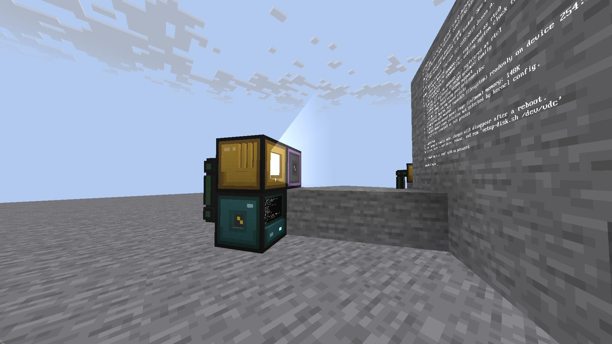

<div align="center">

# OC2R

Minecraft mod adding virtual computers with RISC-V emulation.
Fork of [North-Western-Development/OC2R], itself a fork of [OpenComputers 2] by Sangar.


[English](#english) | [Русский](#русский)

</div>

---



---

## English

### Overview

OC2R is a Minecraft mod that adds fully functional virtual computers to the game. It runs a 64-bit RISC-V virtual machine (powered by [Sedna]) capable of booting Linux, with a high-level Lua API for interacting with in-game devices.

This repository is a **fork** of [North-Western-Development/OC2R], which was itself a **fork** of Sangar's original [OpenComputers 2]. The goal is to continue maintenance, fix bugs, and support newer Minecraft versions.

### Quick Start

1. Craft a computer and place it
2. **Shift + Right-click** (empty hand) → power on
3. **Right-click** (empty hand) → open terminal
4. **Right-click with a wrench** → open inventory to install components

The default Linux image is bundled with the mod - no extra download needed.

> **Try a custom OS:** [OnyxOS] is a hobby operating system (custom kernel, FAT32/OnyxFS, RISC-V) that runs inside OC2R's virtual computers - build the flash image and boot it in-game.

### Features

| Feature | Description |
|---------|-------------|
| RISC-V VM | Full 64-bit RISC-V emulation, boots real Linux |
| Lua API | High-level device interaction without kernel drivers |
| Custom hardware | Blocks, items, cables, screens, keyboards, and more |
| Native networking | Cross-platform native networking library |
| Persistence | Computer state saved between world reloads |
| Device API | Simple Java API for adding virtual devices in addons |

### Compatibility

| Mod | Status |
|-----|--------|
| Create | ✅ Supported |
| Create: Aeronautics | ✅ Supported |
| Valkyrien Skies | ✅ Supported |
| ProjectRed Transmission | ✅ Bundled redstone |
| JEI | ✅ Recipe viewer integration |
| Sable | ✅ Defensive capability lookups |
| Any mod with `WRENCHES` tag | ✅ Automatic wrench support |
| Any mod via IMC | ✅ Custom RPC type adapters |

### Dependencies

- **Required:** NeoForge 21.1.243+, Java 21+
- **Optional:** JEI (recipe viewer)

### Installation

1. Download the jar from [Releases](../../releases)
2. Place it in your `mods/` folder
3. Restart the server or client

---

## Русский

### Обзор

OC2R - мод для Minecraft, добавляющий полноценные виртуальные компьютеры. Он запускает 64-битную RISC-V виртуальную машину (на базе [Sedna]), способную загружать Linux, с высокоуровневым Lua API для взаимодействия с игровыми устройствами.

Этот репозиторий является **форком** [North-Western-Development/OC2R], который сам был **форком** оригинального [OpenComputers 2] от Sangar. Цель - продолжать поддержку, исправлять баги и поддерживать актуальные версии Minecraft.

### Быстрый старт

1. Скрафтите компьютер и поставьте в мире
2. **Shift + ПКМ** (пустой рукой) - включить
3. **ПКМ** (пустой рукой) - открыть терминал
4. **ПКМ с гаечным ключом** - открыть инвентарь для компонентов

Стандартный Linux-образ уже встроен в мод - ничего качать не нужно.

> **Попробуйте свою ОС:** [OnyxOS] - хобби-операционная система (свой кернел, FAT32/OnyxFS, RISC-V), которая запускается на виртуальных компьютерах OC2R - соберите flash-образ и загрузите его в игре.

### Возможности

| Возможность | Описание |
|-------------|----------|
| RISC-V VM | Полная эмуляция 64-битного RISC-V, загрузка реального Linux |
| Lua API | Взаимодействие с устройствами без драйверов ядра |
| Кастомное железо | Блоки, предметы, провода, экраны, клавиатуры и т.д. |
| Нативная сеть | Кроссплатформенная нативная библиотека |
| Персистентность | Состояние компьютера сохраняется между перезагрузками |
| Device API | Простой Java API для добавления устройств в аддоны |

### Совместимость

| Мод | Статус |
|-----|--------|
| Create | ✅ Поддерживается |
| Create: Aeronautics | ✅ Поддерживается |
| Valkyrien Skies | ✅ Поддерживается |
| ProjectRed Transmission | ✅ Bundled redstone |
| JEI | ✅ Интеграция рецептов |
| Sable | ✅ Защитные capability-запросы |
| Любой мод с тегом `WRENCHES` | ✅ Автоматически, гаечный ключ |
| Любой мод через IMC | ✅ Кастомные RPC type-адаптеры |

### Зависимости

- **Обязательные:** NeoForge 21.1.243+, Java 21+
- **Опциональные:** JEI (просмотр рецептов)

### Установка

1. Скачайте jar из [Releases](../../releases)
2. Поместите в папку `mods/`
3. Перезапустите сервер или клиент

---

## Development

### Building

```bash
./gradlew build
```

### Docs

- [Source Structure](docs/SRC_STRUCTURE.md)
- [Architecture](docs/ARCHITECTURE.md)
- [Contributing](CONTRIBUTING.md)

### License

GNU General Public License v3.0. See [LICENSE](LICENSE).

[North-Western-Development/OC2R]: https://github.com/North-Western-Development/OC2R
[OpenComputers 2]: https://github.com/fnuecke/oc2
[Sedna]: https://github.com/fnuecke/sedna
[OnyxOS]: https://github.com/loki5512344/OnyxOS
